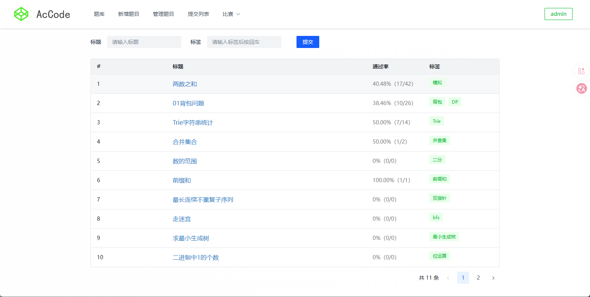
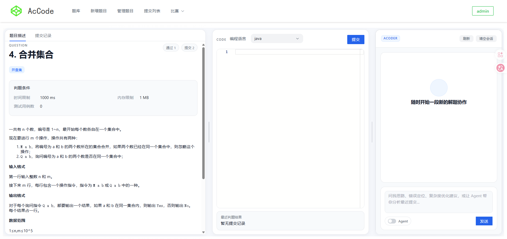
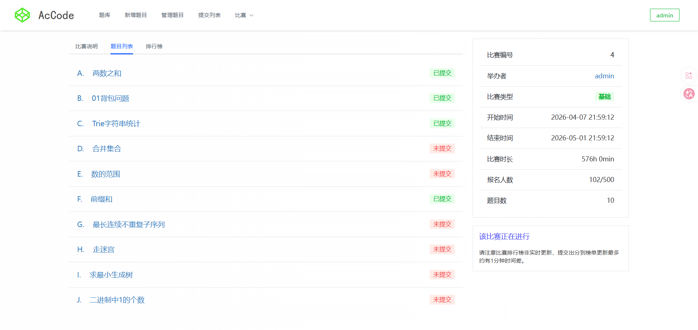
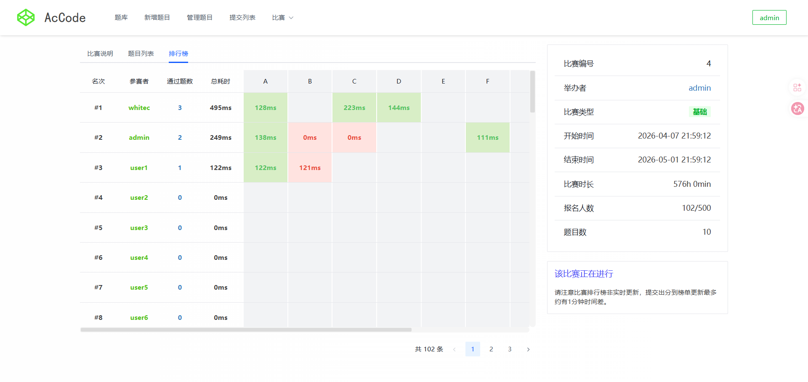
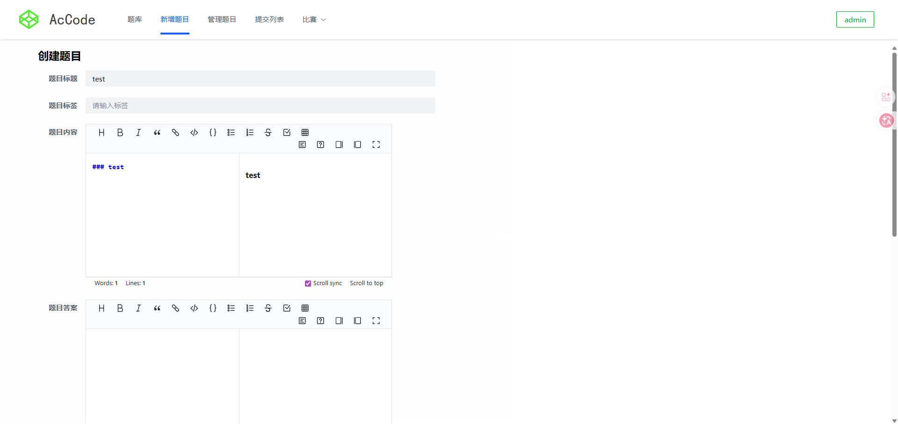

# oj-backend

## 项目简介

`oj-backend` 是一个基于 `Spring Boot 3` 的在线判题（Online Judge）后端项目，面向题目管理、在线提交判题、比赛组织、排行榜统计，以及 AI 辅助答疑等场景。

项目不仅包含传统 OJ 核心能力，还扩展了：

- 比赛报名与比赛题目编排
- 基于 Redis 的比赛排行榜缓存
- AI 对话助手与 SSE 流式返回
- Agent 模式下的工具调用与上下文记忆
- 远程代码沙箱判题能力

适合作为 OJ 平台、编程练习平台、课程实训项目或 AI + OJ 方向的毕业设计后端基础工程。

---

## 核心功能

### 1. 用户模块

- 用户注册、登录、注销
- 获取当前登录用户信息
- 用户资料更新
- 管理员侧用户管理
- 基于 Session 的登录态维护
- 基于 AOP 注解的权限校验

### 2. 题目模块

- 题目新增、编辑、删除、分页查询
- 题目标签管理
- 题目判题配置管理
- 题目测试用例管理
- 个人创建题目列表查询

### 3. 在线判题模块

- 用户提交代码
- 按编程语言选择判题策略
- 调用远程代码沙箱执行代码
- 根据测试用例进行结果比对
- 返回判题状态、耗时、内存、错误用例
- 自动更新题目提交数与通过数

### 4. 比赛模块

- 比赛创建、编辑、删除、查询
- 比赛与题目的关联管理
- 用户报名比赛
- 查询我的比赛、我参加的比赛
- 查询比赛题目列表

### 5. 排行榜模块

- 比赛排行榜分页查询
- Redis ZSet + Hash 缓存排行榜
- 榜单快照持久化到 MySQL
- 提交后增量刷新排行榜
- 事务提交后再刷新缓存，避免脏数据

### 6. AI 模块

- 题目维度的 AI 会话管理
- 普通对话与 Agent 对话模式
- SSE 流式输出
- 会话历史持久化
- 敏感词过滤与违规日志记录
- Prompt 配置、模型配置、禁用规则配置
- 会话自动归档

---






---

## 技术栈

| 分类 | 技术 |
| --- | --- |
| 开发语言 | Java 21 |
| 核心框架 | Spring Boot 3.4.4 |
| Web | Spring Web |
| AOP / 权限 | Spring AOP、自定义 `@AuthCheck` |
| ORM | MyBatis Spring Boot、MyBatis-Plus 3.5.16 |
| 数据库 | MySQL 8 |
| 缓存 | Redis 7 |
| AI 能力 | Spring AI、Spring AI Alibaba、DashScope |
| API 文档 | Knife4j / OpenAPI 3 |
| 工具库 | Hutool、Apache Commons Lang3 |
| 文件处理 | EasyExcel |
| 模板引擎 | Freemarker |
| 构建工具 | Maven |
| 容器化 | Docker、Docker Compose |

---

## 项目亮点

- 业务模块完整：覆盖用户、题目、提交、比赛、榜单、AI 会话等完整 OJ 链路
- 判题链路清晰：提交记录落库后执行判题，并回写判题结果
- 榜单实现更实战：Redis 做热数据缓存，MySQL 做快照兜底
- AI 模块工程化：支持历史记忆、流式输出、敏感词拦截、违规审计
- 可扩展性较好：判题策略、代码沙箱、AI Prompt/模型配置均有扩展空间

---

## 目录结构

```text
oj-backend
├─ src/main/java/com/baimao/oj
│  ├─ ai                  # AI 对话、Agent、Prompt、会话、风控
│  ├─ annotation          # 自定义注解
│  ├─ aop                 # 权限、日志切面
│  ├─ common              # 通用响应、错误码、分页请求
│  ├─ config              # 跨域、JSON、MyBatis-Plus 配置
│  ├─ constant            # 常量定义
│  ├─ controller          # 用户、题目、比赛接口
│  ├─ exception           # 全局异常处理
│  ├─ judge               # 判题核心、策略模式、代码沙箱
│  ├─ mapper              # MyBatis Mapper
│  ├─ model               # entity / dto / vo / enum
│  ├─ service             # 业务服务
│  └─ utils               # 工具类
├─ src/main/resources
│  ├─ application.yml
│  ├─ application-prod.yml
│  └─ mapper              # XML Mapper
├─ src/test/java          # 测试代码
├─ create_table.sql       # 数据库初始化脚本
├─ Dockerfile
├─ docker-compose.yml
└─ pom.xml
```

---

## 数据库表

项目当前主要包含以下核心表：

- `user`：用户表
- `question`：题目表
- `question_submit`：题目提交表
- `contest`：比赛表
- `contest_question`：比赛题目关联表
- `registrations`：比赛报名表
- `contest_rank_snapshot`：排行榜快照表
- `ai_chat_session`：AI 会话表
- `ai_chat_message`：AI 消息表
- `ai_prompt_config`：Prompt 配置表
- `ai_model_config`：模型配置表
- `ai_disable_rule`：AI 禁用规则表
- `ai_sensitive_word`：敏感词表
- `ai_tool_config`：工具配置表
- `ai_tool_call_log`：工具调用日志表
- `ai_violation_log`：违规日志表

初始化时可直接执行根目录下的 `create_table.sql`。

---

## 前端和代码沙箱
前端项目：
<https://github.com/baimao-stu/oj-ai-frontend>

代码沙箱：
<https://github.com/baimao-stu/codesandbox>

## 运行环境

建议环境：

- JDK 21
- Maven 3.9+
- MySQL 8.x
- Redis 7.x
- 可用的代码沙箱服务
- 可用的 DashScope API Key（如需启用 AI）

---

## 快速启动

### 1. 初始化数据库

创建数据库，例如：

```sql
CREATE DATABASE oj DEFAULT CHARACTER SET utf8mb4 COLLATE utf8mb4_unicode_ci;
```

然后执行：

```bash
mysql -uroot -p oj < create_table.sql
```

### 2. 启动 MySQL / Redis

请先确保本地或服务器上已经启动：

- MySQL
- Redis

默认开发配置使用：

- MySQL：`localhost:3306`
- Redis：`127.0.0.1:6379`

### 3. 配置应用参数

修改 `src/main/resources/application.yml` 或通过环境变量覆盖生产配置，重点关注：

- `spring.datasource.*`
- `spring.data.redis.*`
- `codesandbox.url`
- `spring.ai.dashscope.api-key`
- `ai.enabled`

### 4. 启动代码沙箱服务

当前项目默认通过远程代码沙箱执行用户代码：

```yaml
codesandbox:
  type: remote
  url: http://localhost:8888/executeCode
```

### 5. 启动后端服务

开发环境运行：

```bash
mvn spring-boot:run
```

打包运行：

```bash
mvn -DskipTests package
java -jar target/oj-backend-0.0.1-SNAPSHOT.jar
```

生产环境运行：

```bash
java -jar target/oj-backend-0.0.1-SNAPSHOT.jar --spring.profiles.active=prod
```

---

## 默认访问地址

- 服务地址：`http://localhost:50000`
- 接口前缀：`/api`
- 完整 API 根路径：`http://localhost:50000/api`
- Knife4j 文档：`http://localhost:50000/api/doc.html`

---

## 配置说明

### 核心配置项

| 配置项 | 说明 |
| --- | --- |
| `server.port` | 服务端口，默认 `50000` |
| `server.servlet.context-path` | 接口统一前缀，默认 `/api` |
| `spring.datasource.url` | MySQL 连接地址 |
| `spring.data.redis.host` | Redis 地址 |
| `codesandbox.type` | 代码沙箱类型，当前主要使用 `remote` |
| `codesandbox.url` | 代码沙箱执行地址 |
| `ai.enabled` | 是否启用 AI 模块 |
| `ai.retention-days` | AI 会话保留天数 |
| `ai.agent-max-steps` | Agent 最大执行步数 |
| `spring.ai.dashscope.api-key` | DashScope 鉴权 Key |

### 生产环境配置

项目提供了 `application-prod.yml`，支持通过环境变量覆盖关键配置，例如：

- `MYSQL_DB`
- `MYSQL_USER`
- `MYSQL_PASSWORD`
- `REDIS_HOST`
- `REDIS_PORT`
- `REDIS_PASSWORD`
- `DASHSCOPE_API_KEY`
- `DASHSCOPE_MODEL`
- `CODESANDBOX_URL`

---

## 主要接口概览

### 用户接口

- `/api/user/register`
- `/api/user/login`
- `/api/user/logout`
- `/api/user/get/login`
- `/api/user/update/my`

### 题目接口

- `/api/question/add`
- `/api/question/edit`
- `/api/question/delete`
- `/api/question/get/vo`
- `/api/question/list/page/vo`

### 提交判题接口

- `/api/question/question_submit/do_submit`
- `/api/question/question_submit/do_submit_vo`
- `/api/question/question_submit/list/page`

### 比赛接口

- `/api/contest/add`
- `/api/contest/edit`
- `/api/contest/add/registration`
- `/api/contest/list/page/vo`
- `/api/contest/list/rankByContestIdByPage`
- `/api/contest/list/questionVOByContestId`

### AI 接口

- `/api/ai/chat/session/get`
- `/api/ai/chat/session/clear`
- `/api/ai/chat/message/send`
- `/api/ai/chat/message/stream`

---

## 权限与安全设计

- 基于 Session 维护登录态
- 基于 `@AuthCheck` + AOP 实现接口权限控制
- 普通用户与管理员角色区分
- AI 模块支持敏感词拦截
- 支持违规日志记录与禁用规则控制

---

## 后续可优化方向

- 引入消息队列解耦判题与榜单刷新
- 完善提交异步化与任务状态追踪
- 增加更多语言的判题策略
- 增强代码沙箱安全隔离能力
- 增加限流、审计、监控与告警
- 补充 CI/CD、镜像发布与环境分层配置
- 抽离 AI 配置后台管理能力

---

## 注意事项

- 请不要在生产环境中直接使用仓库内的示例密钥、密码和连接配置
- 建议通过环境变量、配置中心或密钥管理系统管理敏感信息
- 如果暂时不使用 AI 功能，可将 `ai.enabled=false`
- 如果代码沙箱不可用，判题能力将无法正常工作
